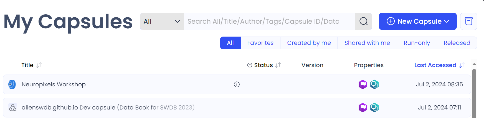
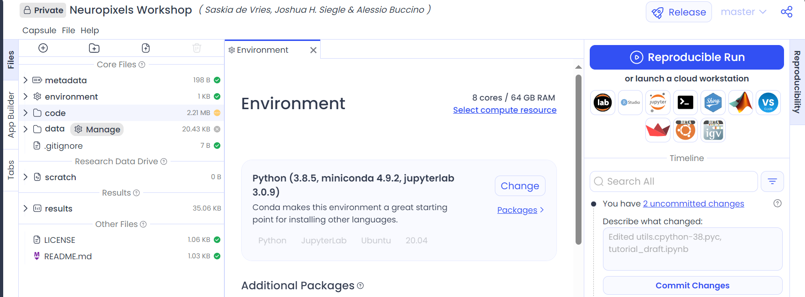
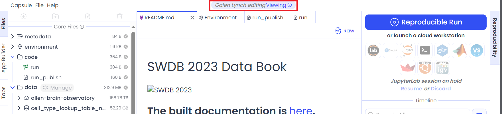
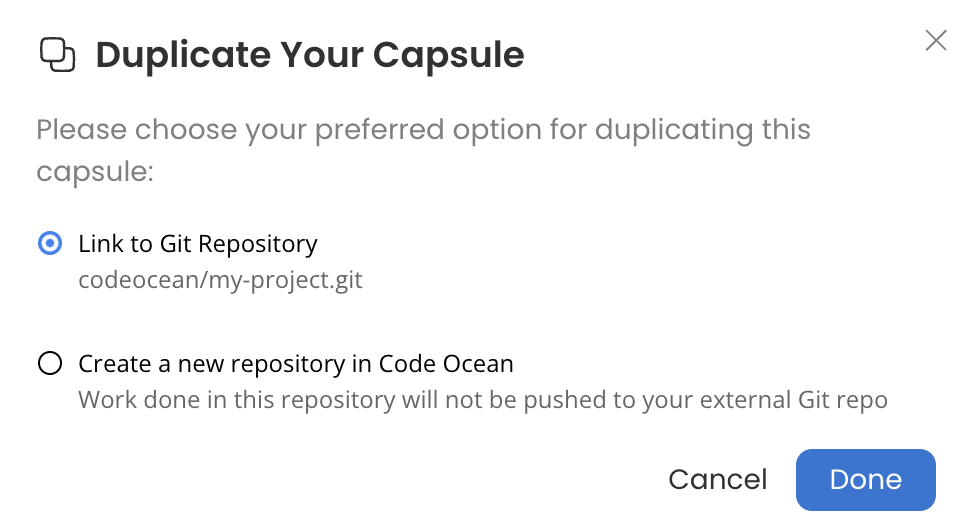
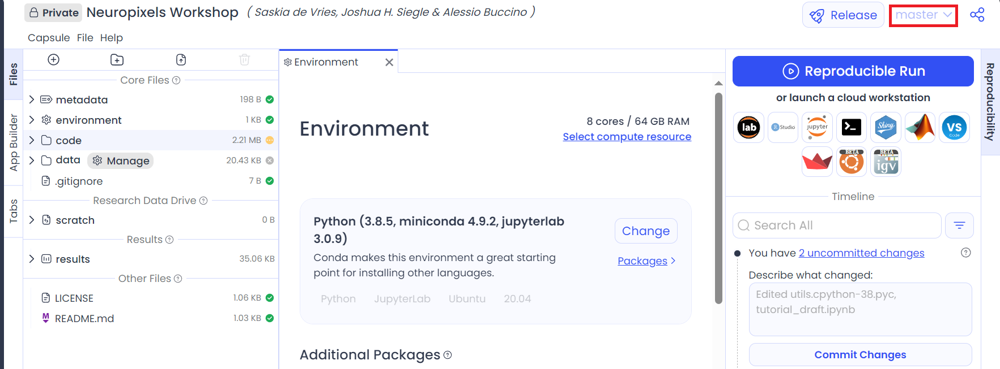
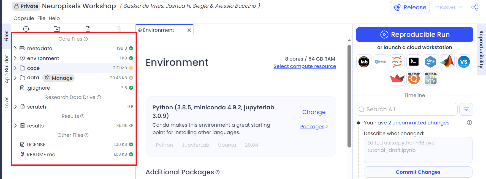

# Code Ocean

## Introduction to Code Ocean
Code Ocean is a powerful cloud-based computing system which is specialized for scientific research applications. It automates deployment of Docker images onto K8 clusters for the user, which allows users to distribute packages of code and its environment without any assumption of experience with Kubernetes or Docker on the part of the audience. This is particularly useful because it allows audiences to exactly reproduce runs from the user; usually, every machine has a slightly different code environment installed, which may result in different results between machines since many code processes are non-commutative. A *software container* contains an exact code environment: the code, the runtime, and the libraries. When deployed, it guarantees that users will not encounter bugs or glitches unique to a specific machine since they will be using the exact same environment and should therefore get exactly the same results. *Docker* is a commonly used system to containerize code into a single *Docker container image* or *Docker file*. *Kubernetes* is a platform commonly used to manage software containers. It creates a group of linked computing nodes, called a *K8 cluster*, and these nodes independently run containers and are controlled by a centralied Kubernetes server which schedules and organizes container deployments.

The advantage of this system is that it allows users to construct even very large applications in small pieces, which can each have their own dependencies. You can think of it as allowing users to write each function in a program independently of the rest, with the program simply calling each individual function in the specified order and passing information from one function to the next. The process of deploying a Kubernetes cluster and scheduling containers can be rather complicated, which is where Code Ocean comes in; it does all of it for the user!

## Code Ocean Overview
The basic units of Code Ocean are **capsules**. These contain the containers used to run the code as well as the results produced and the data used. Capsules are usually linked to Github repositories, allowing users to submit pull requests to GitHub directly from Code Ocean.

When first logging into Code Ocean, the default page you will land on is the "Dashboard" page. The sidebar on the left allows access to various functions in Code Ocean. It is pictured here (albeit rotated for readability)


Going from left to right in the image (top to bottom on the page):

* The stylized $\infty$ simply takes you back to the home page for your organization. 
* The $\oplus$ symbol allows you to create a new system in Code Ocean: a single capsule, a *pipeline*, or a dataset. All three of these will generally be used at some point in the analysis process.
* The triangle takes you back to your dashboard, which contains a list of all containers you have access to.
* The next symbol takes you to all pipelines you have access to. More details on pipelines will follow.
* The stacked cylinders below that take you to data assets. These are all the datasets that you have access to.
* The file symbol takes you to the "Collections" page. Collections allow you to group capsules and pipelines together, so that code for different projects can be grouped according to their projects.
* The rocket symbol takes you to "Internal Releases", which are applications that are complete and fully functional.
* The four squares take you to "Code Ocean Apps", which are various packages and add-ons that have been developed by the community for Code Ocean.

Further below that, there are three more symbols.

* The icon of the person takes you to your personal account and allows you to make changes to personal information.
* The question mark will bring up the databook for Code Ocean.
* The door will log you out of Code Ocean.

### Linking to Outside Systems

In order to access some systems such as Code Ocean or AWS, Code Ocean will need you to provide credentials. These will usually be in the form of an API key or access tokens. Credentials can be added by going to your profile page (the person symbol on the left); the first page you will land on is the Credentials page, and you can provide your GitHub PAT and username by clicking "Add Credentials" in the upper right. If you need Matlab cloud computing (to perform integrations for example), you can also add your MathWorks credentials there. Credentials are automatically accessible by every capsule or pipeline you run.

For other systems which require secret keys, you can add them under "User Secrets" (ex: AWS). These will need to be manually linked to capsules, and should only be linked to capsules which explicitly need them.

Access tokens for Code Ocean may also be generated below that, to allow external programs to access your Code Ocean capsules or pipelines. This may be useful in some specific use cases.

## Code Ocean Capsules

New capsules can be created either from the Dashboard or from the $\oplus$ symbol. From the dashboard, there is a large blue button reading "New Capsule" in the upper right; otherwise, you can click the $\oplus$ symbol. Either method will bring up several options:

* Create New
* Copy from public Git
* Clone from Git

These do precisely what they say. For copying or cloning repositories, you simply paste the URL for the GitHub repo, and Code Ocean will take care of the rest.

### Using and Editing Capsules

The dashboard will list all capsules you have access to and their statuses:



You can sort by any of the column headers and you can access a capsule by just clicking on its name. The status column indicates whether the capsule is currently running, or if it's in a cloud workstation mode, or if it's not active. This can be useful to see where your resources are being used. Version is self-explanatory. The properties column is useful mainly to keep track of what capsules you have permissions for. Capsules you can edit freely will have an "Owned by You" flag. We'll come back to this momentarily.

Once you've accessed a capsule, you'll be brought to a screen that looks like this:



Now, capsules will usually have specific permissions - you should think of them as being like Git repos. If you created your own capsule, naturally, you'll be the person with write permissions, but if you're accessing a capsule written by someone else, you usually won't be able to make edits directly to the main capsule. This will be the case if you have only have "View" permissions. To work with a capsule when you only have "View" permissions, you'll need to duplicate it to your own account, which can be done by clicking on the Capsule drop-down menu in the upper left of the screen and clicking "Duplicate". This will copy the capsule to your own account, allowing you to edit the code and perform runs of your own, but these changes will not be exported to the main capsule; effectively, this is forking the capsule.

You may also be given "Edit" permissions for a capsule. In this case, you'll be able to edit the capsule directly. However, while you are editing the capsule, *everyone else with edit permissions will be locked out*. Only one person can edit a capsule at a time; every other collaborator will be put into view-only mode. Whether you can edit or not is indicated above the file tabs (see the image below, highlighted in red):



In this example, we only have view permissions for the capsule (note that it will tell you who is currently editing the capsule). If instead, we have edit permissions, we would have a "Start editing" button where it currently says Viewing. *This button should be used with caution.* As soon as you click "Start editing", whoever is currently editing will *immediately* be forced out of edit mode, which will discard any unsaved changes they have made. You should always check with whoever is currently in edit mode before you start editing yourself, to make sure work isn't lost.

The bottom right panel in the capsule page contains the version history. It shows run history, all commits, and any releases, which is useful for versioning. It is also used to handle Git changes, which will be explained in more detail below.

To run a capsule, there are two options. You can see that there is ```Reproducible Run``` and ```launch a cloud workstation``` as the options.

```Reproducible Run``` will execute *all* code in the repository according to the **run** script in the capsule's code. This *does not* allow you to edit or to examine the code line-by-line. It is useful if you have a completed or released capsule and you simply want to access the end result. It is also computationally efficient, as it will shut down the server as soon as the run is complete. Because of the aforementioned Docker integration, Reproducible Runs on the same version of the code and data will always produce the same results across users.

```launch a cloud workstation``` allows you to edit the code as you work, and is useful when developing a capsule. There are a variety of editors that Code Ocean supports in the cloud workstation view, including ```Jupyter Lab``` and ```vscode```. However, note that as of the time of writing (July 2nd, 2024), **vscode will usually cause problems for the SWDB capsules**. This is because most of the Docker files that were created for the SWDB capsules do not include the environments necessary to run vscode. As a result, for SWDB capsules, **you should not use vscode unless you are experienced with rebuilding Docker images**.

Once you've initiated a cloud workstation, you'll be placed in a virtual machine where you can edit and run code as you wish. Edits to main files will persist after you're finished working with the cloud workstation, but files that are written to the results folder or that are made to the environment do not persist after the cloud workstation is closed. Changes to results or the environment must be made directly to the capsule.

### Collaboration on Code Ocean

If you have a large number of collaborators, only one person being able to edit the main capsule at a time is a prohibitive bottleneck. Fortunately, it is possible for every collaborator to work on the capsule at once using Git. Unfortunately, the process can be a little convoluted. This process **requires** that you have already provided your Git credentials to Code Ocean. If you have not, Code Ocean will be unable to access any repos that you try to sync to.

#### Syncing Directly With the Git Repo

To collaborate with others, each collaborator can sync their own personal duplicate capsule with the Git repo linked to the main capsule. You have the option to do this when you duplicate the capsule in the first place. If the capsule is synced to a Git repo, upon duplicating, Code Ocean will give you the following prompt:



You should choose "Link to Git Repository". Your duplicated capsule will then be synced to the same Git repo as the original capsule, allowing you to push and pull edits as usual. Once you've done this, you should usually make edits on a separate branch from the main repo. In theory, this means that the main branch will always be a stable version of the capsule, and also allows collaborators to all work independently and then merge their branches with pull requests like one usually does with Git. To create a new branch, you can either create one in GitHub or you can create them in Code Ocean.

#### Using Branches on Code Ocean

Once you've duplicated a capsule and linked it to the Git repo, you can create a new branch in Code Ocean by using the console. To do this, open the Terminal cloud workstation in the capsule you wish to branch. Once the terminal is up, run the following command:

```git branch <new-branch-name>```

This will create the new branch. If you want to immediately switch to that branch, you could alternatively use the command:

```git checkout -b <new-branch-name>```

This command creates the new branch and then switches your capsule to that branch. Either way, once you're finished with creating the branch, you can close out of the terminal to return to the capsule page. To switch between branches that have already been created, you can use the main GUI by clicking on the branch name at the top right, which is boxed in red below.



Note that you must commit or discard all changes you've made to a branch before you can switch branches; Code Ocean does not stash changes like GitHub does.

In the above figure, you'll notice that the timeline below the run options at the bottom right of the page shows uncommitted changes and the option to commit them. Committing changes here will automatically push them to the internal Git repo the capsule uses on Code Ocean. These changes are **not** automatically synced with GitHub, and will appear as "Unsynced commits" in the timeline. Code Ocean will communicate both ways, so it will also tell you that there are unsynced commits if the GitHub repo is ahead of your personal capsule. In order to pull the updates from the Git repo or push your updates to the repo, you simply click on "Sync with GitHub". 

Once you're satisfied with a branch, you can merge it into the main branch by submitting a pull request via GitHub. Merge conflicts can also be resolved there. Pull requests cannot be made on Code Ocean - you'll need to go to GitHub directly to submit the PR.

#### Creating a fork

Alternatively, one can also create a fork of the main repo on GitHub. Once forked, you can then create a Code Ocean capsule from the forked repo and then work in the capsule as described above. The downside to this method is that it will not carry mounted data over to the new capsule, and you will have to manually mount the data again. The upside is that you do not need to have permissions to create and edit branches of the main repo in order to edit and propose changes. This is actually the method you will have to use if you only have read access to the main repo.

As with the other method, once you're satisfied with your capsule, you will need to push your changes from Code Ocean to your forked repo on GitHub. Then, you will need to go onto GitHub and submit a pull request to the upstream repository from your forked repo.

### File Structure of a Capsule

Code Ocean features a GUI with the directory structure on the left side of the main capsule page, boxed in red below:



Generally, you do not want to touch the `environment` folder unless you are the one who is containerizing the code. The environment folder will contain the Dockerfile or container file that contains the information about the environment the capsule is intended to work in. Any change to the Dockerfile is very likely to make the capsule stop functioning, and will certainly result in the results of your capsule being different from other people's capsules. 

The ```code``` directory will contain the actual code and files from GitHub. This will also usually contain a ```run``` file, which is specific to Code Ocean and instructs the capsule how to do a ```Reproducible Run```.

Below that, there will be a ```data``` directory, which is where any datasets you capsule uses will be stored. One of the main features of Code Ocean is that it allows datasets to be centralized in Code Ocean, and then any capsules you create can access that central location. This saves on network time and disk space, and also means that datasets do not need to be transmitted between collaborators - once uploaded, everyone has free access to it. To attach or detach data, you can click on the "manage" button next to the data folder. This will bring up a list of datafiles you have access to. You can then attach the relevant datasets for your capsule by clicking the $\oplus$ symbol next to the dataset's name. Data that is already attached will have a green checkmark next to it; you can also detach data as necessary.

A .gitignore file will usually be located at root level. It's a good idea to - at the very least - include the /data/ folder in your .gitignore, since datasets can be extremely large and we generally don't want to push them to GitHub.

The remaining folders are in the ```Research Data Drive```, the ```Results```, and the ```Other Files```. Intermediate files can be stored safely in the ```Research Data Drive```. These will be files that you produce on the way to your final result, but that you don't want in the Git repo and that you don't need to keep at the end. ```Results``` is where you will want to point the products of `Reproducible Run`. `Results` are kept regardless of changes to the capsule, unless you manually delete them, and allow you to compare the results of different versions of the capsule or to verify that you can reproduce someone else's results. Finally, `Other Files` is a catch-all for any other files that you may have like a ReadMe, which are not necessary for the computation the capsule performs.
